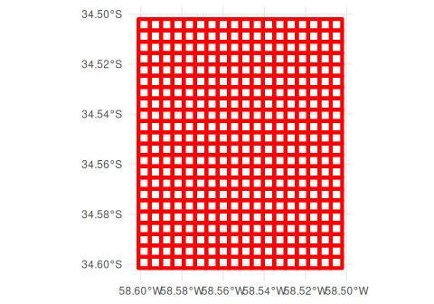
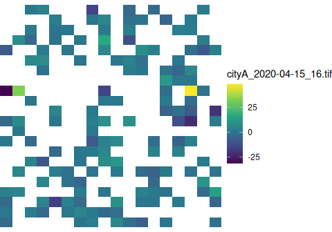
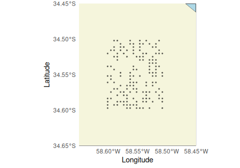
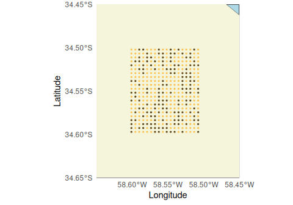
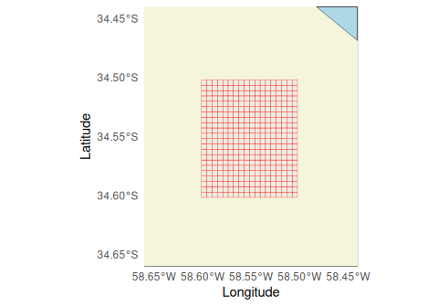
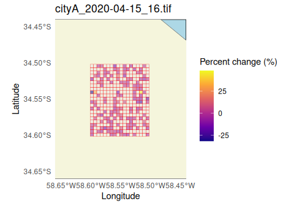

# Converting Meta (Facebook) Mobility QuadKey-identified Datasets into Raster Files

> Please, visit the [README](https://docs.ropensci.org/quadkeyr/) for
> general information about this package

This section focuses on creating a raster from QuadKey data formatted as
provided by [Meta (formerly known as Facebook) mobility
data](https://dataforgood.facebook.com/). If you want to convert other
QuadKey-identified datasets you can read [the previous
vignette.](https://docs.ropensci.org/quadkeyr/articles/quadkey_identified_data_to_raster.html)

Meta (Facebook) mobility data for each location and zoom level is stored
in a separate `csv` file for each day and time.

## 1 Basic workflow


### 1.1 Reading and formatting multiple `csv` Files

- All these files are for the same area and zoom level, but dates and
  hours will change. This information will be evident in the filenames:
  `cityA_2020_04_15_0800.csv`.

- [`read_fb_mobility_files()`](https://docs.ropensci.org/quadkeyr/reference/read_fb_mobility_files.md)
  prints a message with the days or hours missing among the provided
  files.

- The columns `day` and `hour` are created internally.

``` r

files <- quadkeyr::read_fb_mobility_files(
    path_to_csvs = paste0(system.file("extdata",
                                      package = "quadkeyr"), "/"),
    colnames = c( # The columns not listed here will be omitted
      "lat",
      "lon",
      "quadkey",
      "date_time",
      "n_crisis",
      "percent_change",
      "day",
      "hour"
      ),
    coltypes = list(
      lat = 'd',
      lon = 'd',
      quadkey = 'c',
      date_time = 'T',
      n_crisis = 'c',
      percent_change = 'c',
      day = 'D',
      hour = 'i'
    )
  )

head(files)
#> # A tibble: 6 × 8
#>     lat   lon quadkey     date_time           n_crisis percent_change day       
#>   <dbl> <dbl> <chr>       <dttm>                 <dbl>          <dbl> <date>    
#> 1 -34.6 -58.6 2103213001… 2020-04-15 00:00:00       NA           2.86 2020-04-15
#> 2 -34.5 -58.6 2103213001… 2020-04-15 00:00:00       NA          -2.60 2020-04-15
#> 3 -34.6 -58.6 2103213001… 2020-04-15 00:00:00       NA           1.46 2020-04-15
#> 4 -34.5 -58.5 2103213001… 2020-04-15 00:00:00       NA           2.61 2020-04-15
#> 5 -34.5 -58.5 2103213001… 2020-04-15 00:00:00       NA           3.24 2020-04-15
#> 6 -34.5 -58.6 2103213001… 2020-04-15 00:00:00       NA           1.17 2020-04-15
#> # ℹ 1 more variable: hour <dbl>
```

> Note: The Meta (Facebook) mobility data used in `quadkeyr` has been
> altered and doesn’t represent real values. The examples in this
> vignette are only to demostrate how functions work. Please, contact
> [Data for Good](https://dataforgood.facebook.com/) to get datasets.

### 1.2 Create a Quadkey polygon grid for your area of analysis

This function generates a `sf POLYGON data.frame` with a `quadkey` and
`geometry` column.

You might be wondering why we’re not using the function we’ve already
created,
[`add_regular_polygon_grid()`](https://docs.ropensci.org/quadkeyr/reference/add_regular_polygon_grid.md),
which adds a column with QuadKey polygons, creating a regular grid, to
an existing data.frame.

There are two reasons for why we’re using a different approach:

1 - The
[`read_fb_mobility_files()`](https://docs.ropensci.org/quadkeyr/reference/read_fb_mobility_files.md)
output contains multiple datasets for the same area with the almost the
same QuadKeys reported. Using a function that calculates each QuadKey by
row would unnecessarily duplicate calculations.

2 - When you receive Meta (Facebook) mobility data, you might not always
get exactly the same QuadKeys in all the files, even if they all report
the same area. This is especially important considering that you may be
receiving new files in the future with QuadKeys that haven’t been
reported yet.

That’s why we create an `sf` POLYGON data.frame, retaining all the
QuadKey polygons within the area of analysis, and then proceed to join
the results.

If creating the regular polygon grid using the bounding box of the
provided QuadKeys may not work for your case, you can directly create
the grid for the full area of analysis using
[`create_qk_grid()`](https://docs.ropensci.org/quadkeyr/reference/create_qk_grid.md)
function. Read the [the previous
vignette](https://docs.ropensci.org/quadkeyr/articles/quadkey_identified_data_to_raster.html)
to learn more about this function.

``` r

regular_grid <- quadkeyr::get_regular_polygon_grid(data = files)
head(regular_grid$data)
#> Simple feature collection with 6 features and 3 fields
#> Geometry type: POLYGON
#> Dimension:     XY
#> Bounding box:  xmin: -58.59009 ymin: -34.59252 xmax: -58.52417 ymax: -34.51108
#> Geodetic CRS:  WGS 84
#> # A tibble: 6 × 4
#> # Rowwise: 
#>   quadkey                                                   geometry tileX tileY
#>   <chr>                                                <POLYGON [°]> <dbl> <dbl>
#> 1 2103213001233302 ((-58.55713 -34.588, -58.55164 -34.588, -58.5516… 22108 39485
#> 2 2103213001213202 ((-58.5791 -34.51561, -58.57361 -34.51561, -58.5… 22104 39469
#> 3 2103213001233221 ((-58.57361 -34.59252, -58.56812 -34.59252, -58.… 22105 39486
#> 4 2103213001231110 ((-58.54614 -34.52919, -58.54065 -34.52919, -58.… 22110 39472
#> 5 2103213001320003 ((-58.52966 -34.53371, -58.52417 -34.53371, -58.… 22113 39473
#> 6 2103213001230110 ((-58.59009 -34.52919, -58.58459 -34.52919, -58.… 22102 39472
```

``` r

ggplot() +
  geom_sf(data = regular_grid$data, 
          color = 'red', 
          linewidth = 1.5, 
          fill = NA) + 
  theme_minimal()
```



Now, we can merge this grid with the Meta (Facebook) mobility data in
the `files` data.frame. We’ve chosen to use an
[`dplyr::inner_join()`](https://dplyr.tidyverse.org/reference/mutate-joins.html)
that will retain only the polygons reported in the files.

``` r

files_polygons <- files |> 
                  dplyr::inner_join(regular_grid$data, 
                          by = c("quadkey"))

head(files_polygons)
#> # A tibble: 6 × 11
#>     lat   lon quadkey     date_time           n_crisis percent_change day       
#>   <dbl> <dbl> <chr>       <dttm>                 <dbl>          <dbl> <date>    
#> 1 -34.6 -58.6 2103213001… 2020-04-15 00:00:00       NA           2.86 2020-04-15
#> 2 -34.5 -58.6 2103213001… 2020-04-15 00:00:00       NA          -2.60 2020-04-15
#> 3 -34.6 -58.6 2103213001… 2020-04-15 00:00:00       NA           1.46 2020-04-15
#> 4 -34.5 -58.5 2103213001… 2020-04-15 00:00:00       NA           2.61 2020-04-15
#> 5 -34.5 -58.5 2103213001… 2020-04-15 00:00:00       NA           3.24 2020-04-15
#> 6 -34.5 -58.6 2103213001… 2020-04-15 00:00:00       NA           1.17 2020-04-15
#> # ℹ 4 more variables: hour <dbl>, geometry <POLYGON [°]>, tileX <dbl>,
#> #   tileY <dbl>
```

If you want to modify any of the variables you intend to use, it should
be done before this point. For
example,[`apply_weekly_lag()`](https://docs.ropensci.org/quadkeyr/reference/apply_weekly_lag.md)
applies a 7 day lag to `n_crisis` and `percent_change` creating new
variables. You could apply this function to `files` and then select the
resulting variable `percent_change_7` as the argument `var` in
[`polygon_to_raster()`](https://docs.ropensci.org/quadkeyr/reference/polygon_to_raster.md)
We are not demonstrating it in this example.

Now that we have the polygons, let’s create the raster files.

``` r

# Generate the raster files                       
quadkeyr::polygon_to_raster(data = files_polygons,
                  nx = regular_grid$num_cols,
                  ny = regular_grid$num_rows,
                  template = files_polygons,
                  var = 'percent_change',
                  filename = 'cityA',
                  path = paste0( system.file("extdata", 
                                             package = "quadkeyr"),
                                 "/"))
```

``` r

raster <- stars::read_stars(paste0(system.file("extdata", 
                                        package = "quadkeyr"),
                                 "/cityA_2020-04-15_16.tif"))  

# More about plotting: 
# https://r-spatial.github.io/stars/reference/geom_stars.html
ggplot() +
  geom_stars(data = raster) +
  coord_equal()  +
    theme_void() +
  scale_fill_viridis_c(na.value = "transparent")+
    scale_x_discrete(expand=c(0,0))+
    scale_y_discrete(expand=c(0,0))
```



## 2 Advanced use: intermediate functions

The function
[`get_regular_polygon_grid()`](https://docs.ropensci.org/quadkeyr/reference/get_regular_polygon_grid.md)
is a wrapper for
[`quadkey_to_latlong()`](https://docs.ropensci.org/quadkeyr/reference/quadkey_to_latlong.md),
[`regular_qk_grid()`](https://docs.ropensci.org/quadkeyr/reference/regular_qk_grid.md),
and
[`grid_to_polygon()`](https://docs.ropensci.org/quadkeyr/reference/grid_to_polygon.md).
Let’s explore how these functions are operating in isolation.

We will work with the output of the
[`read_fb_mobility_files()`](https://docs.ropensci.org/quadkeyr/reference/read_fb_mobility_files.md),
the same that we have already used in the basic workflow:

``` r

head(files)
#> # A tibble: 6 × 8
#>     lat   lon quadkey     date_time           n_crisis percent_change day       
#>   <dbl> <dbl> <chr>       <dttm>                 <dbl>          <dbl> <date>    
#> 1 -34.6 -58.6 2103213001… 2020-04-15 00:00:00       NA           2.86 2020-04-15
#> 2 -34.5 -58.6 2103213001… 2020-04-15 00:00:00       NA          -2.60 2020-04-15
#> 3 -34.6 -58.6 2103213001… 2020-04-15 00:00:00       NA           1.46 2020-04-15
#> 4 -34.5 -58.5 2103213001… 2020-04-15 00:00:00       NA           2.61 2020-04-15
#> 5 -34.5 -58.5 2103213001… 2020-04-15 00:00:00       NA           3.24 2020-04-15
#> 6 -34.5 -58.6 2103213001… 2020-04-15 00:00:00       NA           1.17 2020-04-15
#> # ℹ 1 more variable: hour <dbl>
```

There are two functions wrapped inside
[`read_fb_mobility_files()`](https://docs.ropensci.org/quadkeyr/reference/read_fb_mobility_files.md)
that you may want to use individually:

- If you wish to correct the Facebook-provided format only, you can
  utilize the
  [`format_fb_data()`](https://docs.ropensci.org/quadkeyr/reference/format_fb_data.md)
  function.
- If you need to retrieve the missing combinations of days and hours in
  a temporal sequence of files, you can employ
  [`missing_combinations()`](https://docs.ropensci.org/quadkeyr/reference/missing_combinations.md).

Please, refer to the examples in the functions’ documentation to
understand better how they work.

### 2.1 Convert the QuadKeys to latitude/longitude coordinates

Even if these files correspond to the same location, the amount of
QuadKeys reported could vary.

To start, we will select from all the files the QuadKeys that appear at
least once and convert them to an `sf` POINT data.frame using
[`quadkey_to_latlong()`](https://docs.ropensci.org/quadkeyr/reference/quadkey_to_latlong.md)

``` r

quadkey_vector <-  unique(files$quadkey)

qtll <- quadkey_to_latlong(quadkey_data = quadkey_vector)
head(qtll)
#> Simple feature collection with 6 features and 1 field
#> Geometry type: POINT
#> Dimension:     XY
#> Bounding box:  xmin: -58.59009 ymin: -34.59704 xmax: -58.52417 ymax: -34.50203
#> Geodetic CRS:  WGS 84
#>              quadkey                    geometry
#> 150 2103213001322002 POINT (-58.53516 -34.56538)
#> 149 2103213001320010 POINT (-58.52417 -34.52466)
#> 148 2103213003011101 POINT (-58.55164 -34.59704)
#> 147 2103213001212132 POINT (-58.59009 -34.50203)
#> 146 2103213001233232 POINT (-58.56812 -34.59252)
#> 145 2103213001213300 POINT (-58.55713 -34.50656)
```

Let’s plot the QuadKey grid.



### 2.2 Complete the grid

Some of the QuadKeys inside the bounding box are missing, we can’t
consider this a regular grid. In order to create the raster images, we
need to obtain a regular grid. We can do that with the function
[`regular_qk_grid()`](https://docs.ropensci.org/quadkeyr/reference/regular_qk_grid.md).
Pay attention that the output is a list with three elements:

- `data`.
- `num_rows` and;  
- `num_cols`.

``` r

regular_grid <- regular_qk_grid(data = qtll)
head(regular_grid)
#> $data
#> Simple feature collection with 396 features and 1 field
#> Geometry type: POINT
#> Dimension:     XY
#> Bounding box:  xmin: -58.60107 ymin: -34.59704 xmax: -58.50769 ymax: -34.50203
#> Geodetic CRS:  WGS 84
#> First 10 features:
#>              quadkey                    geometry
#> 246 2103213001302123 POINT (-58.50769 -34.50203)
#> 245 2103213001302033 POINT (-58.51868 -34.50203)
#> 244 2103213001302032 POINT (-58.52417 -34.50203)
#> 243 2103213001302023 POINT (-58.52966 -34.50203)
#> 242 2103213001213133 POINT (-58.54065 -34.50203)
#> 241 2103213001213123 POINT (-58.55164 -34.50203)
#> 240 2103213001213122 POINT (-58.55713 -34.50203)
#> 239 2103213001213032 POINT (-58.56812 -34.50203)
#> 238 2103213001213023 POINT (-58.57361 -34.50203)
#> 237 2103213001213022  POINT (-58.5791 -34.50203)
#> 
#> $num_rows
#> [1] 22
#> 
#> $num_cols
#> [1] 18
```

The outputs `num_cols` and `num_rows` refer to the number of columns and
rows, information that we will use to create the raster.

The original 150-point grid now has one point per row and cell,
resulting in a complete grid of 369 points, as depicted in the plot. The
additional points are highlighted in orange:



### 2.3 Create the polygons

Now we can transform the QuadKeys into polygons.

``` r

polygrid <- quadkeyr::grid_to_polygon(data = regular_grid$data)
head(polygrid)
#> Simple feature collection with 6 features and 3 fields
#> Geometry type: POLYGON
#> Dimension:     XY
#> Bounding box:  xmin: -58.59009 ymin: -34.59252 xmax: -58.52417 ymax: -34.51108
#> Geodetic CRS:  WGS 84
#> # A tibble: 6 × 4
#> # Rowwise: 
#>   quadkey                                                   geometry tileX tileY
#>   <chr>                                                <POLYGON [°]> <dbl> <dbl>
#> 1 2103213001233302 ((-58.55713 -34.588, -58.55164 -34.588, -58.5516… 22108 39485
#> 2 2103213001213202 ((-58.5791 -34.51561, -58.57361 -34.51561, -58.5… 22104 39469
#> 3 2103213001233221 ((-58.57361 -34.59252, -58.56812 -34.59252, -58.… 22105 39486
#> 4 2103213001231110 ((-58.54614 -34.52919, -58.54065 -34.52919, -58.… 22110 39472
#> 5 2103213001320003 ((-58.52966 -34.53371, -58.52417 -34.53371, -58.… 22113 39473
#> 6 2103213001230110 ((-58.59009 -34.52919, -58.58459 -34.52919, -58.… 22102 39472
```



Once we have the complete grid of QuadKey polygons, we combined the
information with the Facebook data in `files`. In this step, we can
select the variables that will be part of the analysis and also create
new variables if needed.

``` r

polyvar <- files |>
            dplyr::inner_join(polygrid, by = 'quadkey') 

head(polyvar)
#> # A tibble: 6 × 11
#>     lat   lon quadkey     date_time           n_crisis percent_change day       
#>   <dbl> <dbl> <chr>       <dttm>                 <dbl>          <dbl> <date>    
#> 1 -34.6 -58.6 2103213001… 2020-04-15 00:00:00       NA           2.86 2020-04-15
#> 2 -34.5 -58.6 2103213001… 2020-04-15 00:00:00       NA          -2.60 2020-04-15
#> 3 -34.6 -58.6 2103213001… 2020-04-15 00:00:00       NA           1.46 2020-04-15
#> 4 -34.5 -58.5 2103213001… 2020-04-15 00:00:00       NA           2.61 2020-04-15
#> 5 -34.5 -58.5 2103213001… 2020-04-15 00:00:00       NA           3.24 2020-04-15
#> 6 -34.5 -58.6 2103213001… 2020-04-15 00:00:00       NA           1.17 2020-04-15
#> # ℹ 4 more variables: hour <dbl>, geometry <POLYGON [°]>, tileX <dbl>,
#> #   tileY <dbl>
```

### 2.4 Create the rasters for the variables and data involved.

The rasters are going to be created automatically for each day and time
reported. Each raster will be created as `<filename>_<date>_<time>.tif`.
The function
[`polygon_to_raster()`](https://docs.ropensci.org/quadkeyr/reference/polygon_to_raster.md)
will work even if there are gaps in days and hours reported in the
files.

``` r

quadkeyr::polygon_to_raster(data = polyvar,
                  nx = regular_grid$num_cols,
                  ny = regular_grid$num_rows,
                  template = polyvar,
                  var = 'percent_change',
                  filename = 'cityA',
                  path = "../inst/extdata/"
                  )
```

Let’s plot one of the rasters, `"cityA_2020-04-15_8.tif"`. As you can
see, the overlapping with the polygon grid is perfect:


