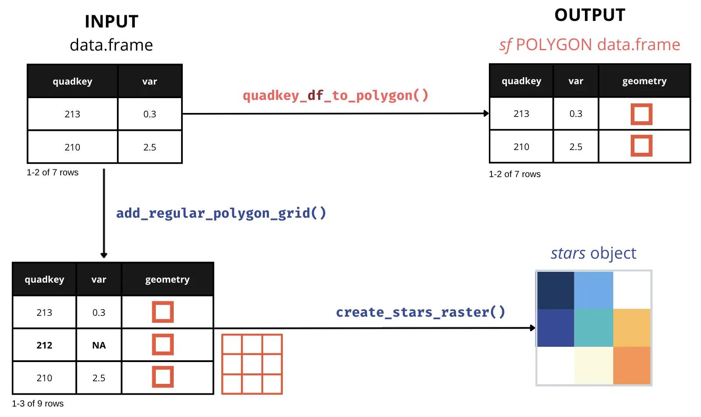
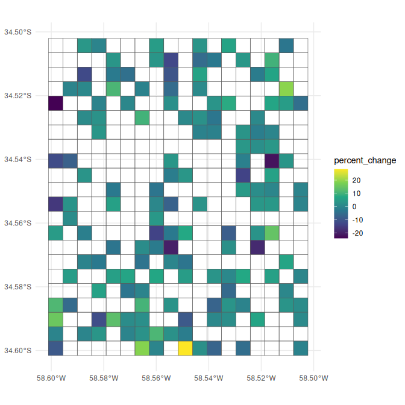
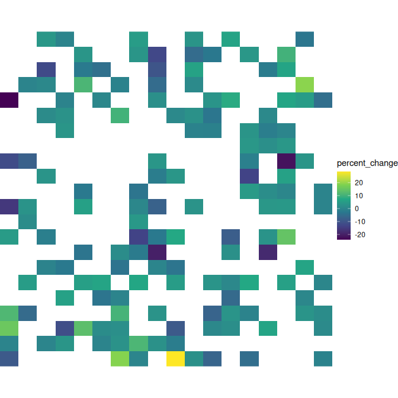
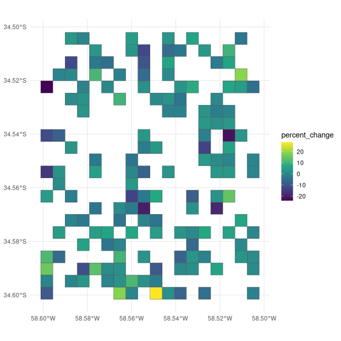
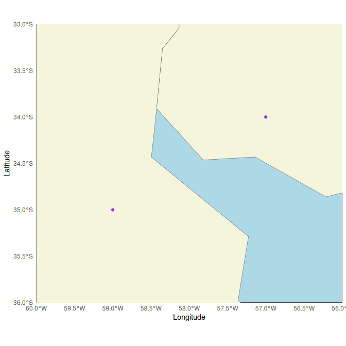
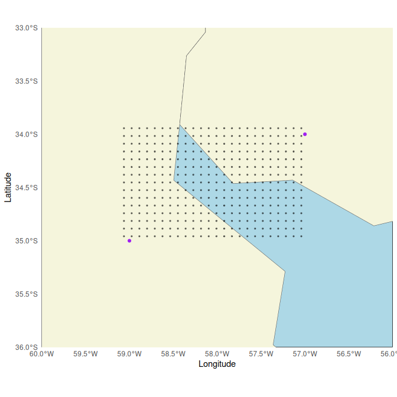
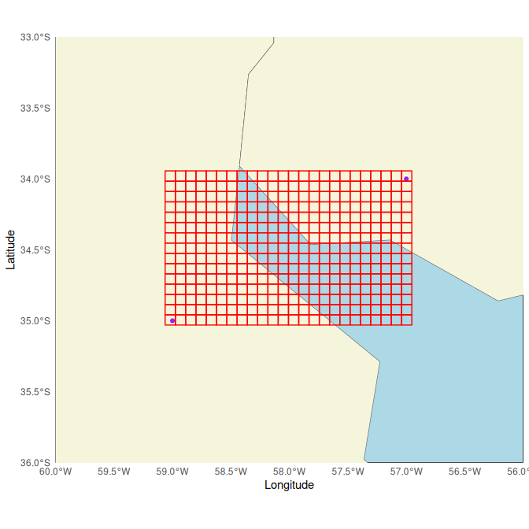
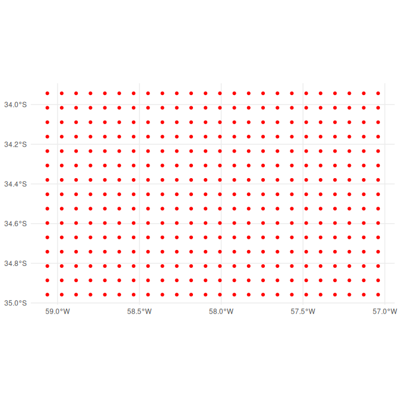
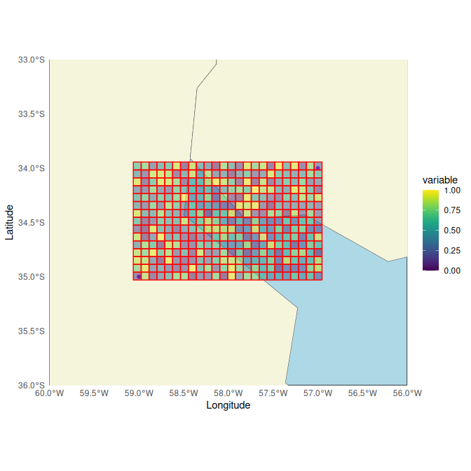

# Generating a Raster Image from Quadkey-Identified Data

> Please, visit the [README](https://docs.ropensci.org/quadkeyr/) for
> general information about this package

Create a raster from QuadKey-identified data for a specified map area
and zoom level. A detailed explanation of what tile coordinates
(`tileX`, `tileY`) and pixel coordinates (`pixelX`, `pixelY`) are can be
found in `quadkeyr` vignette
[`From QuadKey to Simple Features data.frame and other conversions`](https://docs.ropensci.org/quadkeyr/articles/quadkey_to_sf_conversion.html)
and in the [official
documentation](https://learn.microsoft.com/en-us/bingmaps/articles/bing-maps-tile-system).

## 1 Basic workflow



If you are working with a data.frame with a `quadkey` column, as shown
as INPUT in the example image, you can visualize the data by combining
the QuadKeys’ spatial information with any other reported variable. For
example, let’s read an example dataset:

``` r

head(data)
#>   X       lat       lon          quadkey  date_time n_crisis percent_change
#> 1 1 -34.58574 -58.55438 2103213001233302 2020-04-15       NA       2.863940
#> 2 2 -34.51335 -58.57635 2103213001213202 2020-04-15       NA      -2.600991
#> 3 3 -34.59026 -58.57086 2103213001233221 2020-04-15       NA       1.460141
#> 4 4 -34.52692 -58.54340 2103213001231110 2020-04-15       NA       2.607693
#> 5 5 -34.53145 -58.52692 2103213001320003 2020-04-15       NA       3.242862
#> 6 6 -34.52692 -58.58734 2103213001230110 2020-04-15       NA       1.172856
#>          day hour
#> 1 2020-04-15    0
#> 2 2020-04-15    0
#> 3 2020-04-15    0
#> 4 2020-04-15    0
#> 5 2020-04-15    0
#> 6 2020-04-15    0
```

### 1.1 Converting QuadKey-identified data to raster images

To create the raster, it is preferable to work with a regular grid. That
is why we need to ensure that we have all the QuadKeys covering the
bounding box of the area we want to study.

The function
[`add_regular_polygon_grid()`](https://docs.ropensci.org/quadkeyr/reference/add_regular_polygon_grid.md)
retrieves all the QuadKeys required to fill the bounding box created
with the QuadKeys provided in the `quadkey` column. The additional
QuadKeys added in the process will have `NA` values for all columns
except `quadkey` and `geometry`.

If you are unsure whether your grid is complete, you can still run the
function, and it will return the same `sf` POLYGON data.frame without
any extra rows.

``` r

complete_polygon_grid <- add_regular_polygon_grid(data = data)

complete_polygon_grid
#> $data
#> Simple feature collection with 396 features and 9 fields
#> Geometry type: POLYGON
#> Dimension:     XY
#> Bounding box:  xmin: -58.60107 ymin: -34.60156 xmax: -58.5022 ymax: -34.50203
#> Geodetic CRS:  WGS 84
#> # A tibble: 396 × 10
#>    quadkey        X date_time           n_crisis percent_change day         hour
#>  * <chr>      <dbl> <dttm>                 <dbl>          <dbl> <date>     <dbl>
#>  1 210321300…   150 2020-04-15 00:00:00     NA            2.29  2020-04-15     0
#>  2 210321300…   149 2020-04-15 00:00:00    212.           0.848 2020-04-15     0
#>  3 210321300…   148 2020-04-15 00:00:00     NA           28.4   2020-04-15     0
#>  4 210321300…   147 2020-04-15 00:00:00    179.           3.75  2020-04-15     0
#>  5 210321300…   146 2020-04-15 00:00:00     20.3          2.81  2020-04-15     0
#>  6 210321300…   145 2020-04-15 00:00:00     NA          -12.8   2020-04-15     0
#>  7 210321300…   144 2020-04-15 00:00:00    127.          -5.37  2020-04-15     0
#>  8 210321300…   143 2020-04-15 00:00:00     NA            6.60  2020-04-15     0
#>  9 210321300…   142 2020-04-15 00:00:00     NA            3.16  2020-04-15     0
#> 10 210321300…   141 2020-04-15 00:00:00     NA           -2.84  2020-04-15     0
#> # ℹ 386 more rows
#> # ℹ 3 more variables: tileX <dbl>, tileY <dbl>, geometry <POLYGON [°]>
#> 
#> $num_cols
#> [1] 18
#> 
#> $num_rows
#> [1] 22
```

As you can see in the following plot, we obtain a regular polygon grid
where only the QuadKeys that are reported with values for the variable
of interest are colored.

The function
[`add_regular_polygon_grid()`](https://docs.ropensci.org/quadkeyr/reference/add_regular_polygon_grid.md)
returns three outputs in a list:

- `data`
- `num_cols` and;  
- `num_rows`

The number of columns and rows will be useful information for the raster
creation step.

``` r

ggplot() +
  geom_sf(data = complete_polygon_grid$data,
          aes(fill = percent_change)) +
  scale_fill_viridis_c(na.value = "transparent") +
  theme_minimal()
```



After obtaining the regular polygon grid,  
we can create a [STARS
object](https://r-spatial.github.io/stars/articles/stars1.html) using
[`create_stars_raster()`](https://docs.ropensci.org/quadkeyr/reference/create_stars_raster.md).

``` r

stars_object <- create_stars_raster(data = complete_polygon_grid$data,
                    template = complete_polygon_grid$data,
                    var = "percent_change",
                    nx = complete_polygon_grid$num_cols,
                    ny = complete_polygon_grid$num_rows)
stars_object
#> stars object with 2 dimensions and 1 attribute
#> attribute(s):
#>                      Min.  1st Qu.   Median      Mean  3rd Qu.     Max. NAs
#> percent_change  -23.94377 -2.50754 1.109488 0.6168087 3.838209 28.42059 246
#> dimension(s):
#>   from to offset     delta refsys point x/y
#> x    1 18  -58.6  0.005493 WGS 84 FALSE [x]
#> y    1 22  -34.5 -0.004524 WGS 84 FALSE [y]
```

``` r

ggplot() +
  geom_stars(data = stars_object) +
    coord_equal() +
    theme_void() +
    scale_fill_viridis_c(na.value = "transparent") +
    scale_x_discrete(expand=c(0,0))+
    scale_y_discrete(expand=c(0,0))
```



### 1.2 Quadkeys as polygons

If you want to visualize the QuadKeys without creating a raster image,
you also have the option of converting the QuadKeys into an `sf` POLYGON
data.frame using the function
[`quadkey_df_to_polygon()`](https://docs.ropensci.org/quadkeyr/reference/quadkey_df_to_polygon.md),
and then plotting it.

``` r

# create polygon column
poly_data <- quadkey_df_to_polygon(data = data)
poly_data
#> Simple feature collection with 150 features and 9 fields
#> Geometry type: POLYGON
#> Dimension:     XY
#> Bounding box:  xmin: -58.60107 ymin: -34.60156 xmax: -58.5022 ymax: -34.50203
#> Geodetic CRS:  WGS 84
#> First 10 features:
#>     X       lat       lon          quadkey  date_time n_crisis percent_change
#> 1   1 -34.58574 -58.55438 2103213001233302 2020-04-15       NA      2.8639400
#> 2   2 -34.51335 -58.57635 2103213001213202 2020-04-15       NA     -2.6009911
#> 3   3 -34.59026 -58.57086 2103213001233221 2020-04-15       NA      1.4601414
#> 4   4 -34.52692 -58.54340 2103213001231110 2020-04-15       NA      2.6076928
#> 5   5 -34.53145 -58.52692 2103213001320003 2020-04-15       NA      3.2428621
#> 6   6 -34.52692 -58.58734 2103213001230110 2020-04-15       NA      1.1728565
#> 7   7 -34.51787 -58.59283 2103213001212321 2020-04-15 13.07492     -0.3100404
#> 8   8 -34.58574 -58.59833 2103213001232302 2020-04-15       NA     11.4323758
#> 9   9 -34.56764 -58.52142 2103213001322012 2020-04-15       NA    -18.2960744
#> 10 10 -34.55407 -58.59833 2103213001230320 2020-04-15       NA    -15.7189196
#>           day hour                       geometry
#> 1  2020-04-15    0 POLYGON ((-58.55713 -34.588...
#> 2  2020-04-15    0 POLYGON ((-58.5791 -34.5156...
#> 3  2020-04-15    0 POLYGON ((-58.57361 -34.592...
#> 4  2020-04-15    0 POLYGON ((-58.54614 -34.529...
#> 5  2020-04-15    0 POLYGON ((-58.52966 -34.533...
#> 6  2020-04-15    0 POLYGON ((-58.59009 -34.529...
#> 7  2020-04-15    0 POLYGON ((-58.59558 -34.520...
#> 8  2020-04-15    0 POLYGON ((-58.60107 -34.588...
#> 9  2020-04-15    0 POLYGON ((-58.52417 -34.569...
#> 10 2020-04-15    0 POLYGON ((-58.60107 -34.556...
```

``` r

ggplot() +
  geom_sf(data = poly_data,
          aes(fill = percent_change)) +
  scale_fill_viridis_c() +
  theme_minimal()
```



## 2 Advanced use and intermediate functions

The function
[`add_regular_polygon_grid()`](https://docs.ropensci.org/quadkeyr/reference/add_regular_polygon_grid.md)
serves as a wrapper for three functions: `get_qk_coords()`,
[`regular_qk_grid()`](https://docs.ropensci.org/quadkeyr/reference/regular_qk_grid.md),
and
[`grid_to_polygon()`](https://docs.ropensci.org/quadkeyr/reference/grid_to_polygon.md).

We will demonstrate some of the uses of these functions in isolation:

### 2.1 Create a Quadkey-identified polygon regular grid

The
[`regular_qk_grid()`](https://docs.ropensci.org/quadkeyr/reference/regular_qk_grid.md)
function generates a regular grid by utilizing
[`create_qk_grid()`](https://docs.ropensci.org/quadkeyr/reference/create_qk_grid.md).
To accomplish this, it necessitates defining the bounding box, specified
by `xmin`, `xmax`, `ymin`, and `ymax`, which delineates the area for
QuadKey grid creation.
[`regular_qk_grid()`](https://docs.ropensci.org/quadkeyr/reference/regular_qk_grid.md)
supplies these arguments to
[`create_qk_grid()`](https://docs.ropensci.org/quadkeyr/reference/create_qk_grid.md)
by estimating the bounding box from the QuadKeys provided as an
argument. However, if desired, you can manually input these arguments
and use the function by itself.

For this example, we have selected:

- `xmin` = -59  
- `xmax` = -57  
- `ymin` = -35
- `ymax` = -34

Let’s plot them as points.



The QuadKey grid can have a zoom level between 1 (less detail) to 23
(more detail).

The function
[`create_qk_grid()`](https://docs.ropensci.org/quadkeyr/reference/create_qk_grid.md)
will return three outputs:

1.  `grid$data` a dataframe with `tileX`, `tileY` and the QuadKey value
    for each element of the grid

2.  `grid$num_rows` the number of rows and

3.  `grid$num_cols` the number of columns of the grid.

``` r

grid <-  create_qk_grid(
               xmin = -59,
               xmax = -57,
               ymin = -35,
               ymax = -34,
               zoom = 12)
head(grid$data)
#> # A tibble: 6 × 3
#>   tileX tileY quadkey     
#>   <dbl> <dbl> <chr>       
#> 1  1376  2473 210321302002
#> 2  1377  2473 210321302003
#> 3  1378  2473 210321302012
#> 4  1379  2473 210321302013
#> 5  1380  2473 210321302102
#> 6  1381  2473 210321302103
grid$num_rows
#> [1] 15
grid$num_cols
#> [1] 24
```

#### 2.1.1 Get the grid coordinates from the QuadKeys

The coordinates can be extracted from the QuadKeys using the function
`get_qk_coords()`.

``` r

grid_coords <- get_qk_coord(data = grid$data)
head(grid_coords)
#> Simple feature collection with 6 features and 3 fields
#> Geometry type: POINT
#> Dimension:     XY
#> Bounding box:  xmin: -59.0625 ymin: -34.958 xmax: -58.62305 ymax: -34.958
#> Geodetic CRS:  WGS 84
#> # A tibble: 6 × 4
#>   tileX tileY quadkey                 geometry
#>   <dbl> <dbl> <chr>                <POINT [°]>
#> 1  1376  2473 210321302002  (-59.0625 -34.958)
#> 2  1377  2473 210321302003 (-58.97461 -34.958)
#> 3  1378  2473 210321302012 (-58.88672 -34.958)
#> 4  1379  2473 210321302013 (-58.79883 -34.958)
#> 5  1380  2473 210321302102 (-58.71094 -34.958)
#> 6  1381  2473 210321302103 (-58.62305 -34.958)
```

We can visualize the points in the map to understand better the results.


We have a grid of points representing the QuadKeys. Remember that these
points represent the upper-left corner of each QuadKey, which might give
the impression that they do not precisely cover the entire area defined
by the initial points.

#### 2.1.2 Conversion to polygons

As we are creating the polygons from a `sf` POINT data.frame we can use
[`grid_to_polygon()`](https://docs.ropensci.org/quadkeyr/reference/grid_to_polygon.md).

``` r

polygrid <- grid_to_polygon(grid_coords)
polygrid
#> Simple feature collection with 360 features and 3 fields
#> Geometry type: POLYGON
#> Dimension:     XY
#> Bounding box:  xmin: -59.0625 ymin: -35.03 xmax: -56.95312 ymax: -33.94336
#> Geodetic CRS:  WGS 84
#> # A tibble: 360 × 4
#> # Rowwise: 
#>    tileX tileY quadkey                                                  geometry
#>  * <dbl> <dbl> <chr>                                               <POLYGON [°]>
#>  1  1399  2459 210321132133 ((-57.04102 -34.01624, -56.95312 -34.01624, -56.953…
#>  2  1398  2459 210321132132 ((-57.12891 -34.01624, -57.04102 -34.01624, -57.041…
#>  3  1397  2459 210321132123 ((-57.2168 -34.01624, -57.12891 -34.01624, -57.1289…
#>  4  1396  2459 210321132122 ((-57.30469 -34.01624, -57.2168 -34.01624, -57.2168…
#>  5  1395  2459 210321132033 ((-57.39258 -34.01624, -57.30469 -34.01624, -57.304…
#>  6  1394  2459 210321132032 ((-57.48047 -34.01624, -57.39258 -34.01624, -57.392…
#>  7  1393  2459 210321132023 ((-57.56836 -34.01624, -57.48047 -34.01624, -57.480…
#>  8  1392  2459 210321132022 ((-57.65625 -34.01624, -57.56836 -34.01624, -57.568…
#>  9  1391  2459 210321123133 ((-57.74414 -34.01624, -57.65625 -34.01624, -57.656…
#> 10  1390  2459 210321123132 ((-57.83203 -34.01624, -57.74414 -34.01624, -57.744…
#> # ℹ 350 more rows
```



It worked! As you can see here, the coordinates we randomly selected as
a starting point for the bounding box are situated within the polygons,
but not at a specific position inside each polygon. This was expected,
you can read about Quadkey conversion in the vignette
[`From a QuadKey to a Simple Features data.frame and other conversions`](https://docs.ropensci.org/quadkeyr/articles/quadkey_to_sf_conversion.html#caveats-when-converting-coordinates).

If you want to see the grid, you can also check the app:

``` r

qkmap_app()
```


### 2.2 Raster creation

Let’s generate the raster. `data_provided` is an example
QuadKey-identified data.frame.

``` r

data('data_provided')
head(data_provided)
#>        quadkey variable
#> 1 210321132133     0.22
#> 2 210321132311     0.56
#> 3 210321132313     0.27
#> 4 210321132331     0.06
#> 5 210321132333     0.88
#> 6 210321310111     0.22
```

The function
[`get_qk_coord()`](https://docs.ropensci.org/quadkeyr/reference/get_qk_coord.md)
allow us converting the data to an `sf` POINT data.frame keeping our
variable of interest.

``` r

data_sfpoint <- get_qk_coord(data = data_provided)
head(data_sfpoint)
#> Simple feature collection with 6 features and 4 fields
#> Geometry type: POINT
#> Dimension:     XY
#> Bounding box:  xmin: -57.04102 ymin: -34.30714 xmax: -57.04102 ymax: -33.94336
#> Geodetic CRS:  WGS 84
#>        quadkey variable tileX tileY                    geometry
#> 1 210321132133     0.22  1399  2459 POINT (-57.04102 -33.94336)
#> 2 210321132311     0.56  1399  2460 POINT (-57.04102 -34.01624)
#> 3 210321132313     0.27  1399  2461 POINT (-57.04102 -34.08906)
#> 4 210321132331     0.06  1399  2462 POINT (-57.04102 -34.16182)
#> 5 210321132333     0.88  1399  2463 POINT (-57.04102 -34.23451)
#> 6 210321310111     0.22  1399  2464 POINT (-57.04102 -34.30714)
```



In this case, it seems we are working with a regular grid, so we can
skip
[`regular_qk_grid()`](https://docs.ropensci.org/quadkeyr/reference/regular_qk_grid.md).
If you execute it, it will only confirm with a message and return the
same `sf` POINT data.frame. This function returns a list, providing you
with the number of columns and rows that we will have to introduce as
arguments of
[`create_stars_raster()`](https://docs.ropensci.org/quadkeyr/reference/create_stars_raster.md)

``` r

data_raster <- regular_qk_grid(data = data_sfpoint)
head(data_raster)
#> $data
#> Simple feature collection with 360 features and 4 fields
#> Geometry type: POINT
#> Dimension:     XY
#> Bounding box:  xmin: -59.0625 ymin: -34.958 xmax: -57.04102 ymax: -33.94336
#> Geodetic CRS:  WGS 84
#> First 10 features:
#>         quadkey variable tileX tileY                    geometry
#> 1  210321132133     0.22  1399  2459 POINT (-57.04102 -33.94336)
#> 2  210321132311     0.56  1399  2460 POINT (-57.04102 -34.01624)
#> 3  210321132313     0.27  1399  2461 POINT (-57.04102 -34.08906)
#> 4  210321132331     0.06  1399  2462 POINT (-57.04102 -34.16182)
#> 5  210321132333     0.88  1399  2463 POINT (-57.04102 -34.23451)
#> 6  210321310111     0.22  1399  2464 POINT (-57.04102 -34.30714)
#> 7  210321310113     0.22  1399  2465 POINT (-57.04102 -34.37971)
#> 8  210321310131     0.26  1399  2466 POINT (-57.04102 -34.45222)
#> 9  210321310133     0.16  1399  2467 POINT (-57.04102 -34.52466)
#> 10 210321310311     0.99  1399  2468 POINT (-57.04102 -34.59704)
#> 
#> $num_rows
#> [1] 15
#> 
#> $num_cols
#> [1] 24
```

``` r

polygon_raster <- grid_to_polygon(data = data_raster$data)
head(polygon_raster)
#> Simple feature collection with 6 features and 4 fields
#> Geometry type: POLYGON
#> Dimension:     XY
#> Bounding box:  xmin: -59.0625 ymin: -35.03 xmax: -58.97461 ymax: -34.59704
#> Geodetic CRS:  WGS 84
#> # A tibble: 6 × 5
#>   quadkey      variable tileX tileY                                     geometry
#>   <chr>           <dbl> <dbl> <dbl>                                <POLYGON [°]>
#> 1 210321302002     0.1   1376  2473 ((-59.0625 -35.03, -58.97461 -35.03, -58.97…
#> 2 210321302000     0.75  1376  2472 ((-59.0625 -34.958, -58.97461 -34.958, -58.…
#> 3 210321300222     0.89  1376  2471 ((-59.0625 -34.88593, -58.97461 -34.88593, …
#> 4 210321300220     0.85  1376  2470 ((-59.0625 -34.8138, -58.97461 -34.8138, -5…
#> 5 210321300202     0.36  1376  2469 ((-59.0625 -34.74161, -58.97461 -34.74161, …
#> 6 210321300200     0.87  1376  2468 ((-59.0625 -34.66936, -58.97461 -34.66936, …
```

Now, we can use the data.frame to create the raster:

``` r

raster <-  create_stars_raster(template = polygon_raster,
                               nx = data_raster$num_cols,
                               ny = data_raster$num_rows,
                               data = polygon_raster,
                               var = 'variable')

raster
#> stars object with 2 dimensions and 1 attribute
#> attribute(s):
#>           Min. 1st Qu. Median      Mean 3rd Qu. Max.
#> variable     0    0.22   0.49 0.5028611    0.76    1
#> dimension(s):
#>   from to offset    delta refsys point x/y
#> x    1 24 -59.06  0.08789 WGS 84 FALSE [x]
#> y    1 15 -33.94 -0.07244 WGS 84 FALSE [y]

# If you want to save it:
# write_stars(obj = raster,
#             dsn = "raster.tif")
```


