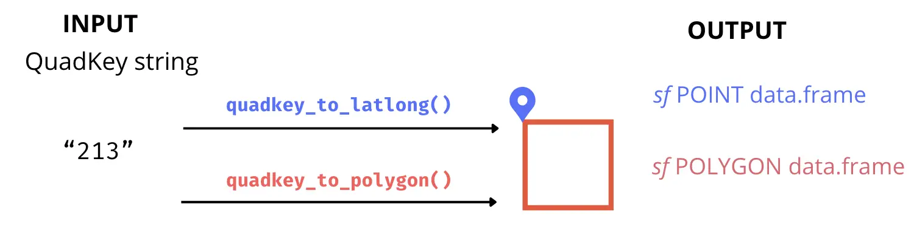
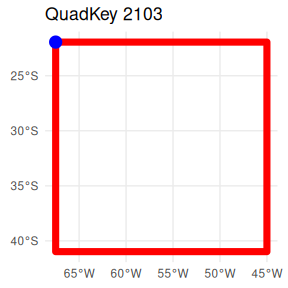
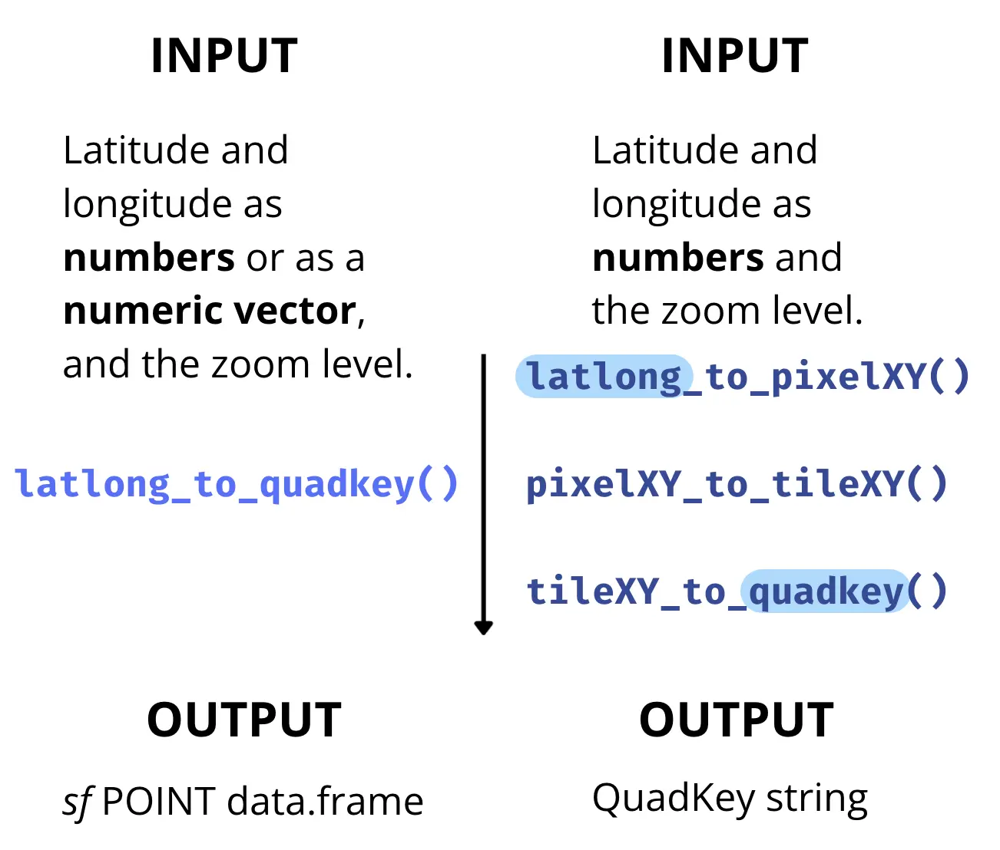
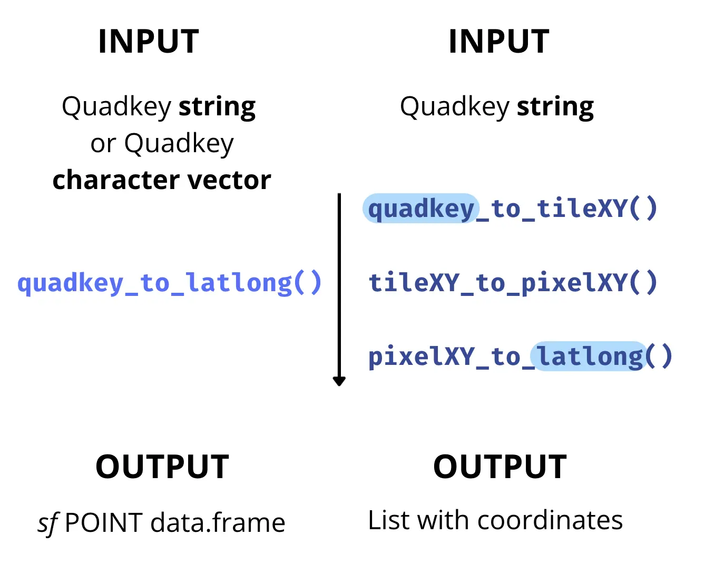
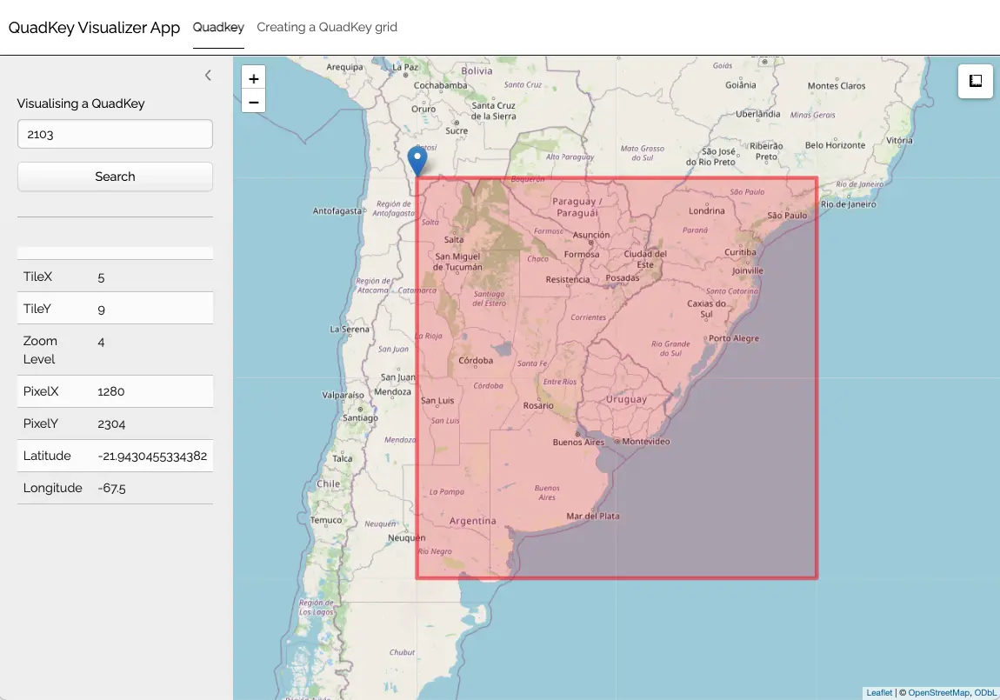

# From a QuadKey to a Simple Features data.frame and other conversions

> Please, visit the [README](https://docs.ropensci.org/quadkeyr/) for
> general information about this package

`quadkeyr` functions are the R version of the ones described in the
documentation at [Bing Maps Tile System
webpage](https://learn.microsoft.com/en-us/bingmaps/articles/bing-maps-tile-system).
Most of the function and arguments names are preserved from the
documentation, if not it will be indicated in the text.

## 1 Basic workflow



You can convert any QuadKey to a [Simple Features
object](https://r-spatial.github.io/sf/articles/sf1.html#sf-objects-with-simple-features)
`sf` POINT data.frame or `sf` POLYGON data.frame using the functions
[`quadkey_to_latlong()`](https://docs.ropensci.org/quadkeyr/reference/quadkey_to_latlong.md)
and
[`quadkey_to_polygon()`](https://docs.ropensci.org/quadkeyr/reference/quadkey_to_polygon.md).
It’s important to notice that the geographic coordinates of the point
will always correspond to the upper-left corner of the polygon for the
same QuadKey.

``` r

qtll <- quadkey_to_latlong(quadkey = "2103")
qtll
#> Simple feature collection with 1 feature and 1 field
#> Geometry type: POINT
#> Dimension:     XY
#> Bounding box:  xmin: -67.5 ymin: -21.94305 xmax: -67.5 ymax: -21.94305
#> Geodetic CRS:  WGS 84
#>   quadkey                geometry
#> 1    2103 POINT (-67.5 -21.94305)
```

``` r

qtp <- quadkey_to_polygon(quadkey = "2103")
qtp
#> Simple feature collection with 1 feature and 1 field
#> Geometry type: POLYGON
#> Dimension:     XY
#> Bounding box:  xmin: -67.5 ymin: -40.9799 xmax: -45 ymax: -21.94305
#> Geodetic CRS:  WGS 84
#>   quadkey                       geometry
#> 1    2103 POLYGON ((-67.5 -40.9799, -...
```

``` r

ggplot() +
  geom_sf(data = qtp, color = 'red', fill = NA, linewidth = 2.5) +
  geom_sf(data = qtll, color = 'blue', size = 4) + 
  ggtitle(paste("QuadKey", qtll$quadkey)) +
  theme_minimal()
```

 If you want to
convert a data.frame with a `quadkey` column into a `sf` POLYGON
data.frame. you can use the function
[`quadkey_df_to_polygon()`](https://docs.ropensci.org/quadkeyr/reference/quadkey_df_to_polygon.md)
described in the
[`Generating a Raster Image from Quadkey-Identified Data`
vignette](https://docs.ropensci.org/quadkeyr/articles/quadkey_identified_data_to_raster.html)

## 2 Advanced use: intermediate functions

The conversion from QuadKey to geographic coordinates involves a series
of smaller transformations that relate to the structure of Tile Maps.
All of these intermediary functions, as well as those facilitating the
reverse conversion from geographic coordinates to QuadKey, are available
for use within the `quadkeyr` package.

### 2.1 Tile Maps: QuadKeys, tiles, pixels and geographic coordinates

> Note: In the official documentation, the term ‘level of detail’ is
> equivalent to what is here referred to as ‘zoom level’.

Tile maps are composed of pixels that are grouped into tiles. Later, the
tiles are converted to QuadKeys to optimize map performance, among other
benefits described in detail in [the
documentation](https://learn.microsoft.com/en-us/bingmaps/articles/bing-maps-tile-system).

Pixels and tiles are expressed as two-dimensional coordinates -
(`pixelX`, `pixelY`) and (`tileX`, `tileY`) - but QuadKeys are
one-dimensional numeric strings. This difference is important to
understand how the conversion works.

Each geographic pair of coordinates (latitude/longitude) will belong to
a specific pixel referenced by coordinates (`pixelX`, `pixelY`) for each
zoom level. In Fig. 1, you can see pixels (0, 0) and (2047, 2047) for
zoom level 3. The `quadkeyr` function
[`latlong_to_pixelXY()`](https://docs.ropensci.org/quadkeyr/reference/latlong_to_pixelXY.md),
converts geographic coordinates (latitude/longitude) in pixel
coordinates for each zoom level.


Fig 1. Pixels (0, 0) and (2047, 2047) for a map with zoom level 3. Image
extracted from Microsoft’s Bing Maps Tile System webpage.

In turn, a tile is comprised of 256x256 pixels. The tile coordinates are
visually represented in Fig. 2. These coordinates will ultimately be
converted into one-dimensional QuadKeys.

For instance, a pixel for zoom level 3 represented by the coordinates
`pixelX` = 255 and `pixelY` = 12 is part of the tile with coordinates
`tileX` = 0 and `tileY` = 0. The pixel with coordinates (0,0) belongs to
tile (0,0), and the pixel (2047, 2047) is part of tile (7,7). You can
verify this using the function
[`pixelXY_to_tileXY()`](https://docs.ropensci.org/quadkeyr/reference/pixelXY_to_tileXY.md)
and by comparing Fig. 1 and Fig. 2.


Fig 2. Tile coordinates. Image extracted from Microsoft’s Bing Maps Tile
System webpage.

To convert from tile XY coordinates to QuadKeys for a particular zoom
level, you can use the function
[`tileXY_to_quadkey()`](https://docs.ropensci.org/quadkeyr/reference/tileXY_to_quadkey.md).
The number of digits of the QuadKey will correspond to the zoom level of
the map. For example, for the tile (4, 7) of zoom level 3, the QuadKey
will be `322`.

This pertains to the conversion from geographic coordinates
(latitude/longitude) to QuadKeys. However, when converting in the
opposite direction, from QuadKeys to geographic coordinates, the
latitude/longitude obtained correspond to the upper-left corner
coordinates of the tile and pixel associated with your original QuadKey.

To understand this in more detail, have a look to the functions and then
read section 3.

### 2.2 If you have geographic map coordinates, convert them to QuadKeys

**Geographic coordinates** → **pixel XY coordinates** → **tile XY
coordinates** → **QuadKey**

> Note: The latitude and longitude coordinates are in the WGS 84
> reference system.

#### 2.2.1 Convert latitude/longitude coordinates to pixel XY coordinates

``` r

lltp <- latlong_to_pixelXY(lat = -25, 
                           lon = -53, 
                           zoom = 4)
lltp
#> $pixelX
#> [1] 1445
#> 
#> $pixelY
#> [1] 2342
```

#### 2.2.2 Convert pixel XY coordinates into tile XY coordinates

``` r

ptt <- pixelXY_to_tileXY(pixelX = lltp$pixelX,
                         pixelY = lltp$pixelY)
ptt
#> $tileX
#> [1] 5
#> 
#> $tileY
#> [1] 9
```

#### 2.2.3 Convert tile XY coordinates into a QuadKey

This function returns the QuadKey string. Since we are estimating zoom
level 4, the QuadKey has 4 digits.

``` r

tileXY_to_quadkey(tileX = ptt$tileX,
                  tileY = ptt$tileY,
                  zoom = 4)
#> [1] "2103"
```

#### 2.2.4 Direct conversion from geographic coordinates to one or more QuadKeys



The function
[`latlong_to_quadkey()`](https://docs.ropensci.org/quadkeyr/reference/latlong_to_quadkey.md)
wraps the last three functions, and converts map coordinates into a
QuadKey for a particular zoom level:

``` r

latlong_to_quadkey(lat = -25,
                   lon = -53,
                   zoom = 4)
#> Simple feature collection with 1 feature and 1 field
#> Geometry type: POINT
#> Dimension:     XY
#> Bounding box:  xmin: -53 ymin: -25 xmax: -53 ymax: -25
#> Geodetic CRS:  WGS 84
#>   quadkey        geometry
#> 1    2103 POINT (-53 -25)
```

This function also work for multiple coordinates:

``` r

latlong_to_quadkey(lat = c(-4, -25.33, -25.66),
                   lon = c(-53, -60.33, -70.66),
                   zoom = 4)
#> Simple feature collection with 3 features and 1 field
#> Geometry type: POINT
#> Dimension:     XY
#> Bounding box:  xmin: -70.66 ymin: -25.66 xmax: -53 ymax: -4
#> Geodetic CRS:  WGS 84
#>   quadkey              geometry
#> 1    2101        POINT (-53 -4)
#> 2    2103 POINT (-60.33 -25.33)
#> 3    2102 POINT (-70.66 -25.66)
```

### 2.3 If you have QuadKeys, convert them to map coordinates

Let’s attempt the reverse route.

**QuadKey** → **tile XY coordinates** → **pixel XY coordinates** →
**Geographic coordinates**

#### 2.3.1 Convert a QuadKey into tile XY coordinates

``` r

qtt <- quadkey_to_tileXY("2103")
qtt
#> $tileX
#> [1] 5
#> 
#> $tileY
#> [1] 9
#> 
#> $zoom
#> [1] 4
```

#### 2.3.2 Convert tile XY coordinates into pixel XY coordinates

``` r

ttp <- tileXY_to_pixelXY(tileX = qtt$tileX,
                         tileY = qtt$tileY)
ttp
#> $pixelX
#> [1] 1280
#> 
#> $pixelY
#> [1] 2304
```

#### 2.3.3 Convert pixel XY coordinates into lat/long coordinates

``` r

ptll <- pixelXY_to_latlong(pixelX = ttp$pixelX,
                           pixelY = ttp$pixelY,
                           zoom = 4)

ptll
#> $lat
#> [1] -21.94305
#> 
#> $lon
#> [1] -67.5
```

#### 2.3.4 Direct conversion from one or more QuadKeys to geographic coordinates



You can also use the function
[`quadkey_to_latlong()`](https://docs.ropensci.org/quadkeyr/reference/quadkey_to_latlong.md)
that wraps the last three functions and returns a `sf` POINT data.frame.

``` r

quadkey_to_latlong(quadkey_data = "2103")
#> Simple feature collection with 1 feature and 1 field
#> Geometry type: POINT
#> Dimension:     XY
#> Bounding box:  xmin: -67.5 ymin: -21.94305 xmax: -67.5 ymax: -21.94305
#> Geodetic CRS:  WGS 84
#>   quadkey                geometry
#> 1    2103 POINT (-67.5 -21.94305)
```

``` r

quadkey_to_latlong(quadkey_data = c("213", "212", "210"))
#> Simple feature collection with 3 features and 1 field
#> Geometry type: POINT
#> Dimension:     XY
#> Bounding box:  xmin: -90 ymin: -40.9799 xmax: -45 ymax: 0
#> Geodetic CRS:  WGS 84
#>   quadkey             geometry
#> 3     210        POINT (-90 0)
#> 2     212 POINT (-90 -40.9799)
#> 1     213 POINT (-45 -40.9799)
```

## 3 Caveats when converting coordinates

Given the process of converting geographic coordinates
(latitude/longitude) to QuadKeys, one might expect that the conversion
back to latitude/longitude coordinates (as in section 2.3) would yield
the same values as the original input in section 1.

However, this isn’t the case, as evidenced by the results of the
functions
[`pixelXY_to_tileXY()`](https://docs.ropensci.org/quadkeyr/reference/pixelXY_to_tileXY.md)
and `tileXY_to_pixel_XY()`.

When choosing latitude/longitude coordinates in the initial function in
section 1, they were within a specific pixel represented by unique tile
coordinates and QuadKey. As you can see in the example in this vignette,
the conversion back from QuadKey to latitude/longitude does not directly
result in the same initial geographic coordinates.

This discrepancy arises because `tileXY_to_pixel_XY()` provides the
pixel coordinates for the upper-left corner of the tile, not the exact
coordinates chosen initially. For example, if you run
[`tileXY_to_pixelXY()`](https://docs.ropensci.org/quadkeyr/reference/tileXY_to_pixelXY.md)
for the tile XY coordinates are (7, 7), the resulting pixel XY
coordinates are (1792, 1792) and no (2047, 2047) as you could see in
Fig. 2. As each tile is 256x256 pixels, you can easily check that the
result is the upper-left pixel of that tile. The same will happen for
[`pixelXY_to_latlong()`](https://docs.ropensci.org/quadkeyr/reference/pixelXY_to_latlong.md).

Hence, converting latitude/longitude coordinates into a QuadKey and then
back to latitude/longitude won’t yield identical values, unless the
initial latitude/longitude coordinates correspond to the upper-left to
the upper-left Quadkey’s pixel and tile XY coordinates at the same zool
level.

Consider as initial values the coordinates result of the conversion from
QuadKey to latitude/longitude obtained in section 2.3
`(lat = -21.94305, lon = -67.5)` and rerun all functions from the
beginning. You’ll proof this way that obtaining the original geographic
coordinates is unlikely unless the initial coordinates correspond to the
upper-left upper-left Quadkey’s pixel and tile XY coordinates.

Understanding this distinction is crucial for the accurate use of these
functions in coordinate conversions.

#### 3.0.1 Additional functions

In addition to the conversion functions mentioned earlier, the
`quadkeyr` package also includes the following functions:
[`mapsize()`](https://docs.ropensci.org/quadkeyr/reference/mapsize.md),
[`mapscale()`](https://docs.ropensci.org/quadkeyr/reference/mapscale.md),
and
[`ground_res()`](https://docs.ropensci.org/quadkeyr/reference/ground_res.md).
These functions are described on the [Bing Maps Tile System
webpage](https://learn.microsoft.com/en-us/bingmaps/articles/bing-maps-tile-system)
and are available for its use.

## 4 QuadKey map visualizer app

You can visualize the QuadKey location in the map using the Shiny app
included in this package.

``` r

qkmap_app()
```


