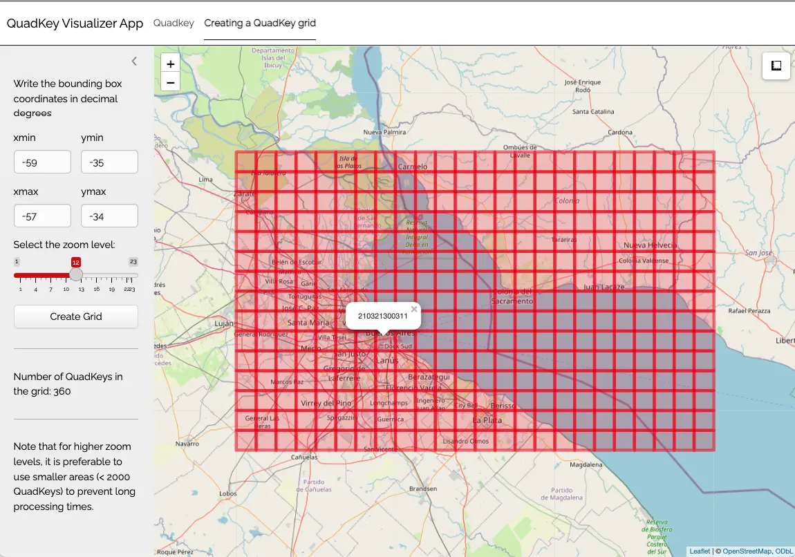

# QuadKey Visualization App

> Please, visit the [README](https://docs.ropensci.org/quadkeyr/) for
> general information about this package

To easily visualize:

1.  The QuadKey location based on provided geographic coordinates, and
2.  The grid for the area delimited by two pairs of geographic
    coordinates, you can utilize the internal app provided by
    `quadkeyr`.

## 1 Run the app

You can open the app running:

``` r

quadkeyr::qkmap_app()
```

## 2 Tabs

### 2.1 QuadKey tab

On the first tab, you can locate the upper corner of the QuadKey on the
map and discover its zoomlevel, as well as the associated tile and pixel
coordinates.


### 2.2 Creating a QuadKey grid tab

The second tab allows you to visualize the grid created using the
`grid_to_polygon` function and locate specific QuadKeys.



## 3 Performance

Note that for higher levels of detail, it is preferable to use smaller
areas (\< 2000 QuadKeys) to prevent long processing times.
